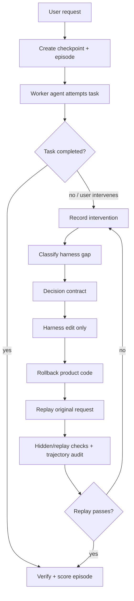

# VibeHarness Landing Architecture

This is the practical version of VibeHarness. It is not a paper protocol; it is
a repository workflow that can be used with Codex, Claude Code, Cursor,
OpenHands, or a custom agent runner.

## The Right Abstraction

VibeHarness should be a small repository-native runtime, not a new monolithic
agent product.

The core is agent-agnostic:

- checkpoint before task work;
- episode package for every non-trivial run;
- explicit decision contract before harness edits;
- harness edit scope separated from product-code scope;
- rollback and replay from the original checkpoint;
- trajectory audit for permissions and information flow;
- scorecard that separates "task passed" from "harness improved".

Agent integrations are thin:

- Codex and compatible agents read `AGENTS.md`.
- Claude Code reads `CLAUDE.md`, project commands in `.claude/commands`, and
  optional hooks in `.claude/settings.json`.
- Cursor reads `.cursor/rules/*.mdc`.
- OpenHands reads `.openhands/microagents/*.md` and repository setup scripts.

This keeps the system portable and avoids betting the whole workflow on one
vendor's internal agent loop.

## Operating Modes

### VH-Lite

Use for everyday coding tasks:

1. create an episode;
2. write acceptance criteria;
3. run visible checks;
4. record interventions;
5. finish with a scorecard.

No mandatory rollback unless a harness failure appears.

### VH-Recovery

Use when the agent gets stuck or the user intervenes:

1. classify the intervention;
2. write a decision contract;
3. edit only allowed harness artifacts;
4. roll back product-code changes to the checkpoint;
5. replay the original request;
6. score replay and trajectory safety.

### VH-Transfer

Use weekly or before release:

1. group episodes by failure class and transfer group;
2. reuse harness repairs on held-out tasks;
3. measure whether human interventions drop;
4. remove low-value harness growth.

## Repository Layout

```text
.vibeharness/
  config.json
  episodes/
  templates/
AGENTS.md
CLAUDE.md
.claude/commands/
.cursor/rules/
.openhands/microagents/
scripts/
```

## The Production Loop



## What Counts as a Harness Edit

Allowed harness edits include:

- setup and bootstrap scripts;
- test and verification commands;
- browser, logging, metric, or tracing adapters;
- acceptance criteria documents;
- repository memory and agent instruction files;
- subagent role definitions and handoff rules;
- permission policy and audit rules.

Product-code edits are not harness edits. The whole point is to avoid smuggling
the application fix into the harness layer.

## Default Recommendation

For real projects, start with VH-Lite in every agent session and only escalate
to VH-Recovery when one of these happens:

- user manually runs a command for the agent;
- user manually validates UI/API behavior;
- user clarifies acceptance criteria after a wrong implementation;
- tests pass but the user says behavior is wrong;
- the agent loops on environment setup;
- review feedback points to a missing recurring rule.

This keeps overhead low while still capturing the moments that actually improve
future reliability.
