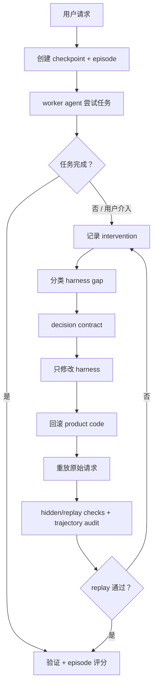

# VibeHarness 落地架构

[English](landing_architecture.md) | 简体中文

这是 VibeHarness 的实用版本。它不是论文协议，而是一套可以在 Codex、Claude Code、Cursor、OpenHands 或自定义 agent runner 中使用的仓库工作流。

## 正确抽象

VibeHarness 应该是一个小型 repository-native runtime，而不是新的大型 agent 产品。

核心部分与具体 agent 无关：

- 任务开始前 checkpoint；
- 每个非平凡 run 都生成 episode package；
- 修改 harness 前先写明确的 decision contract；
- harness edit scope 与 product-code scope 分离；
- 从原始 checkpoint rollback/replay；
- 对权限和信息流做 trajectory audit；
- 用 scorecard 区分“任务通过”和“harness 真的变好了”。

agent 集成应该保持很薄：

- Codex 和兼容 agent 读取 `AGENTS.md`。
- Claude Code 读取 `CLAUDE.md`、`.claude/commands` 中的 project commands，以及可选 hooks。
- Cursor 读取 `.cursor/rules/*.mdc`。
- OpenHands 读取 `.openhands/microagents/*.md` 和仓库 setup scripts。

这样可以保持系统可移植，不把整个 workflow 绑定到某个厂商的内部 agent loop。

## 运行模式

### VH-Lite

日常 coding task 使用：

1. 创建 episode；
2. 写 acceptance criteria；
3. 运行 visible checks；
4. 记录 interventions；
5. 用 scorecard 收尾。

除非出现 harness failure，否则不强制 rollback。

### VH-Recovery

当 agent 卡住或用户介入时使用：

1. 对 intervention 分类；
2. 写 decision contract；
3. 只编辑允许的 harness artifacts；
4. 把 product-code changes 回滚到 checkpoint；
5. 重新执行原始请求；
6. 评估 replay 和 trajectory safety。

### VH-Transfer

每周或 release 前使用：

1. 按 failure class 和 transfer group 聚合 episodes；
2. 在 held-out tasks 上复用 harness repairs；
3. 衡量人类干预是否下降；
4. 删除低价值的 harness growth。

## 仓库布局

```text
.vibeharness/
  config.json
  episodes/
  templates/
AGENTS.md
CLAUDE.md
.claude/commands/
.cursor/rules/
.openhands/microagents/
scripts/
```

## 生产循环



## 什么算 Harness Edit

允许的 harness edits 包括：

- setup 和 bootstrap scripts；
- test 和 verification commands；
- browser、logging、metric、tracing adapters；
- acceptance criteria 文档；
- repository memory 和 agent instruction files；
- subagent role definitions 和 handoff rules；
- permission policy 和 audit rules。

product-code edits 不是 harness edits。核心目标是避免把应用修复偷偷藏进 harness 层。

## 默认建议

真实项目中，默认每个 agent session 使用 VH-Lite。只有当下面情况出现时，再升级到 VH-Recovery：

- 用户手动为 agent 运行命令；
- 用户手动验证 UI/API 行为；
- 用户在错误实现后补充 acceptance criteria；
- tests 通过但用户认为行为错误；
- agent 在环境 setup 上循环；
- review feedback 指向缺失的可复用规则。

这样能保持低开销，同时捕获真正能提升未来可靠性的时刻。
